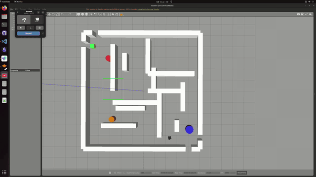

# TurtleBot3 迷宫导航

[English](README.en.md)



这是一个基于 ROS 1 Noetic 和 Gazebo 的 TurtleBot3 迷宫自主探索仿真项目。机器人在 迷宫中使用激光雷达和里程计建图，自主探索未知区域、规划路径并避开动态障碍物，直到相机检测到代表终点的绿色目标正方体。

本项目主要用于课程实验和算法演示，组合使用现有 ROS 导航组件，并不是重新实现一套导航框架。

## 核心功能

- GMapping SLAM：根据 `/scan` 和 `/odom` 构建占据栅格地图。
- `explore_lite`：选择前沿区域并交给 `move_base` 导航。
- `move_base`：使用 A* 全局规划器和 DWA 局部规划器生成速度指令。
- Gazebo 迷宫：包含墙体、绿色目标、移动圆柱障碍物和行走角色。
- 目标检测：连续检测到绿色目标 5 帧后，取消导航并停止机器人。
- 规划器对比：可独立比较 Dijkstra 和 A* 的路径与搜索开销。

## 快速开始

环境要求：ROS Noetic、Gazebo、TurtleBot3 软件包和 Python 3。也可以使用仓库内的 `.devcontainer/` 配置。

首次使用 Docker 或 Dev Container 时，请先按 [Docker / Dev Container 环境配置](docs/docker-setup.md) 安装依赖并验证环境。

在仓库根目录执行一条命令即可启动。脚本会自动加载 ROS 环境、设置默认机器人型号，并在首次运行时构建工作区：

```bash
./run_maze.sh
```

脚本默认启用软件渲染，避免在容器中使用默认图形驱动时 Gazebo 窗口卡住；图形渲染会使用 CPU。

默认不启动动态障碍物。需要启用时，将 launch 参数直接传给脚本：

```bash
./run_maze.sh dynamic_obstacles:=true
```

墙厚默认采用 `maze22.world` 中的 0.4 米。可在启动时指定其他厚度；脚本会生成临时 world，不修改源码：

```bash
./run_maze.sh wall_thickness:=0.35
```

无图形界面的环境可以使用：

```bash
./run_maze.sh gui:=false headless:=true
```

## 导航流程

```text
LiDAR + Odometry → GMapping → Occupancy Grid
                              ↓
       explore_lite → move_base (A* + DWA) → /cmd_vel
                              ↑
                   RGB Camera → Green Goal Detector
```

## 目录结构

```text
run_maze.sh                         # 一条命令启动完整仿真
src/
├── my_launch/
│   ├── launch/maze_exploration.launch  # 完整仿真入口
│   └── config/                         # SLAM、代价地图和规划器参数
└── my_maze_world/
    ├── worlds/maze22.world             # 主迷宫世界
    ├── models/                         # Gazebo 模型
    └── scripts/                        # 障碍物、行走角色和目标检测节点
```

## 规划器基准测试

```bash
python3 src/my_maze_world/scripts/compare_planners.py
python3 src/my_maze_world/scripts/compare_planners.py --csv results.csv
```

基准测试在同一个网格迷宫上比较 Dijkstra 和 A*，输出路径长度、规划时间和扩展节点数等指标。
